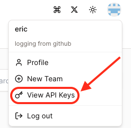

# rebyte-cli

# Introduction
Rebyte-cli is a command line tool for **rebyte.ai**. It can help you to manage your rebyte project via command line. 
* Manage your agent
* Manage your agent extension
* Manage your knowledge base

# Install

You may install rebyte cli using the following scripts.

> **⚠️ Note:** We use a short link to download install script. If you encounter error when using short link
> you can try our full link
replace the short link `https://shorturl.at/cGH23` to `https://raw.githubusercontent.com/rebyteai/rebyte-cli/main/install.sh`

### On Windows
Using PowerShell:
```iwr
iwr https://shorturl.at/cGH23 -useb | iex
```

### On POSIX systems

```sh
curl -fsSL https://shorturl.at/cGH23 | sudo sh -
```

If you don't have curl installed, you would like to use wget:

```sh
wget -qO- https://shorturl.at/cGH23 | sudo sh -
```

<!-- On Alpine Linux
# bash
wget -qO- https://raw.githubusercontent.com/rebyteai/rebyte-cli/main/install.sh | ENV="$HOME/.bashrc" SHELL="$(which bash)" bash -
# sh
wget -qO- https://raw.githubusercontent.com/rebyteai/rebyte-cli/main/install.sh | ENV="$HOME/.shrc" SHELL="$(which sh)" sh -
# dash
wget -qO- https://raw.githubusercontent.com/rebyteai/rebyte-cli/main/install.sh | ENV="$HOME/.dashrc" SHELL="$(which dash)" dash - -->

> **⚠️ Note:** Scripts will download rebyte binray to `/usr/local/bin` directory.
> Make sure the `/usr/local/bin` directory exists and in your `PATH` environment
> variable

# Using rebyte CLI to create action extension

## Login through rebyte api

#### 1. generate rebyte api KEY from https://rebyte.ai



#### 2. login using your api

```
rebyte login -k <your rebyte api key>
```

> For cn user, you can use `rebyte login -k <your rebyte api key> -u https://colingo.ai`

## Create Extension

You need to go to UI to create an extension first.

http://rebyte.ai/p/<Your_Project_Id>/settings/extensions


## Deploy Extension

Using `rebyte deploy` to deploy your project. Your project dir must have a
`rebyte.json` file

```
rebyte deploy <your project dir>
```

## Show help message

```
rebyte --help
```
